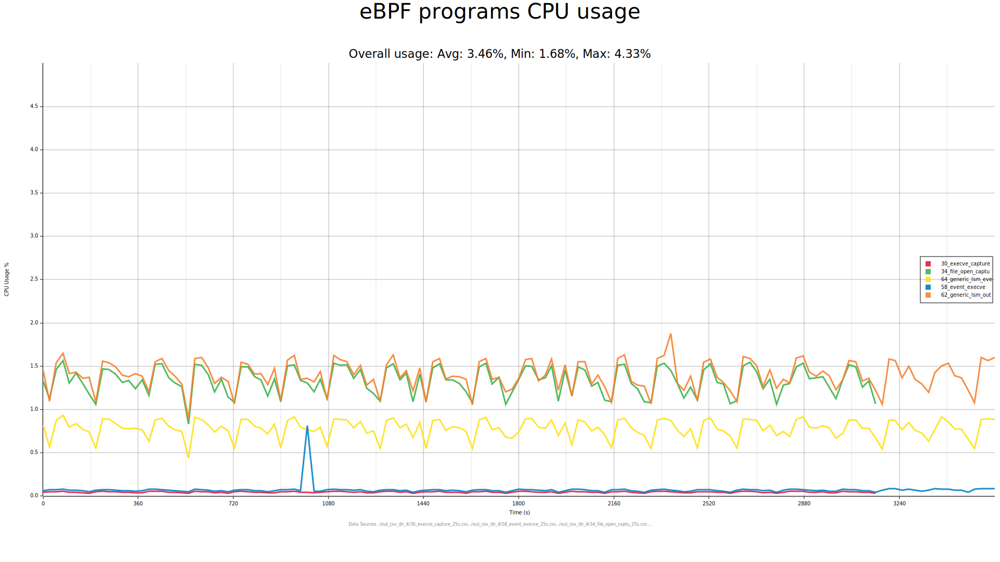

# Bpfmeter

Bpfmeter is a tool for measuring the performance of eBPF programs. It enables CPU load measurement, supports local execution, stores data into CSV files, and implements a Prometheus client for exporting metrics to monitoring systems.

## Quick start

### Run locally

To run the agent:

```shell
$ bpfmeter run -o outdir/
```

The arguments specify the measurement period and the output directory where CSV files will be saved once the agent is stopped. By default, the tool starts monitoring all loaded eBPF programs. Users can specify particular eBPF program IDs using the `-p` option to track specific instances.

Example of a generated CSV:

```csv
exact_cpu_usage,run_time,run_count
0.0037179608,0.017889192,182679
0.0026831191,0.020577219,212503
0.0028221705,0.023404128,235003
0.004331591,0.027743375,293565
0.0044721225,0.03222083,348499
```

Each row contains the percentage of CPU usage, processor time spent by the eBPF program, and the number of its executions during the specified time intervals.

To visualize the collected data you need to install pkg-config, libfreetype-dev, and libfontconfig1-dev packages and run command:

```bash
$ bpfmeter draw -i outdir/ -o svgdir/
```

The resulting plot(s) will be saved in the `svgdir` directory. Example:



### Container installation

You can deploy bpfmeter as a container. Choose the desired version and pull the image:

```shell
$ docker pull ghcr.io/trndcenter/bpfmeter:v0.1.0
```

and run the agent:

```shell
$ docker run --rm -it --cap-add=CAP_SYS_ADMIN ghcr.io/trndcenter/bpfmeter:v0.1.0 run -o outdir/
```

### Kubernetes installation

It is also possible to use bpfmeter in your Kubernetes cluster by applying the provided manifest:

```shell
$ kubectl apply -f install/kubernetes/bpfmeter-agent.yaml
```

For advanced Kubernetes manifest management, refer to the [installation documentation](install/kubernetes).

### Prometheus exporter

The agent implements a Prometheus client interface to export metrics in OpenMetrics format to monitoring systems. If the agent was built using the container image, it can be launched as follows:

```shell
$ docker run --rm -it -p 9100:9100 --cap-add=CAP_SYS_ADMIN ghcr.io/trndcenter/bpfmeter:v0.1.0 run --labels system=bpfmeter -P 9100
```

If no output directory is specified, the agent automatically starts the Prometheus client on the given port. Along with CPU usage metrics, the labels provided in the command-line arguments will be sent.

The collected metrics can be scraped or forwarded via the Remote Write protocol. Example using [Victoria Metrics](https://github.com/VictoriaMetrics/VictoriaMetrics) agent:

```bash
$ vmagent -promscrape.config=config.yaml -remoteWrite.url=<RemoteWriteEndpoint> -remoteWrite.bearerToken=<API_TOKEN> -remoteWrite.flushInterval=30s
```

Example `config.yaml`:

```yaml
global:
  scrape_interval: 30s
scrape_configs:
   - job_name: 'prometheus'
     static_configs:
       - targets: ['127.0.0.1:9100']
         labels:
           instance: 'localhost'
     sample_limit: 10
     label_limit: 30
```

You can also use the [Vector](https://github.com/vectordotdev/vector) agent with config:

```yaml
role: "Agent"

customConfig:
  data_dir: /vector-data-dir
  api:
    enabled: true
    address: 127.0.0.1:8686
    playground: false
  sources:
    prometheus_metrics:
      type: prometheus_scrape
      endpoints:
        - 127.0.0.1:9100/metrics
      scrape_interval: 30
  sinks:
    remote_write_metrics:
      type: prometheus_remote_write
      inputs: ["prometheus_metrics"]
      endpoint: "<RemoteWriteEndpoint>"
```

## Development

To build the project, Rust should be installed. Installation instructions can be found [here](https://www.rust-lang.org/tools/install). The tool supports generating various plots by default, which requires the pkg-config, libfreetype-dev, and libfontconfig1-dev packages. On Ubuntu, they can be installed via apt:

```bash
$ apt install pkg-config libfreetype-dev libfontconfig1-dev
```

Run local build:

```bash
$ just build
```

If plot rendering features are not needed:

```bash
$ just build-minimized
```

Apply linter and formatter with:

```shell
$ just lint && just fmt
```

For running tests you need to install [bpftrace](https://github.com/bpftrace/bpftrace) and add it to the `PATH` environment variable. It is also important to have `CAP_SYS_ADMIN` capability for testing. You can start tests with following command:

```bash
$ sudo -E env "PATH=$PATH" just test
```

You could also build a container with the tool ([Dockerfile](Dockerfile)):

```bash
$ docker build . -t bpfmeter
```

